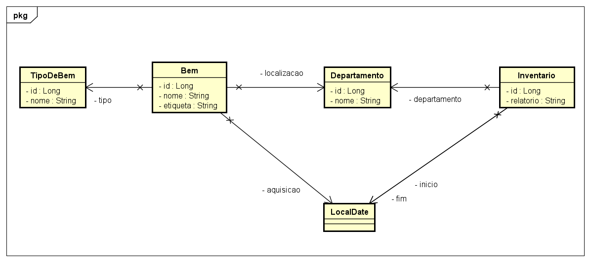

# Sistema de Inventário dos Bens da Holding Benezinho 🤓👍🏾

CP-I - Enterprise Application Development aplicada em 30/08/2023.


|                | **Enterprise Application Development** |
|------------------------------------------|----------------------------------------|
| **ALUNO:**                               | **TURMA:** 2TDSPT  - 2TDSPR            |
| **PROFESSOR:** Benefrancis do Nascimento | 30/08/2023                             |
| **CP-I**                                 | ****                                   |

# Sumário


[Estudo de caso ](#_Estudo_de_caso)

[O que deverá ser feito? ](#_O_que_devera_ser_feito)

[Diagrama de Classes ](#_Diagrama_de_Classes)

[Como Entregar ](#_Entrega)

[Correção da Prova ](#_Correcao)

<a id="_Estudo_de_caso"></a>

# Estudo de caso

Para uma holding, um Sistema de Informação para controle de inventário de bens desempenha um papel crucial na gestão eficiente de seus ativos. Uma holding é uma empresa que possui participações em outras empresas, mas não necessariamente está envolvida diretamente na produção de bens ou serviços. No entanto, ela pode ter uma ampla gama de ativos, como participações em outras empresas, investimentos financeiros, propriedades imobiliárias e outros bens tangíveis e intangíveis.

Um sistema de controle de inventário permite que a **Holding Benezinho** 🤓👍🏾 acompanhe e registre todos os ativos de sua propriedade. Isso inclui informações detalhadas sobre as participações em empresas, títulos, propriedades e outros ativos, permitindo uma visão geral completa de seu portfólio.

Por esses e outros motivos decidimos desenvolver nosso próprio **Sistema de Controle de Inventário**.

Criaremos, inicialmente, um Produto Mínimo Viável (PMV). Para início das atividades de desenvolvimento, nossa equipe de analistas projetou o Diagrama de Classes abaixo, e a sua missão aqui é realizar o Mapeamento Objeto Relacional das classes de Entidade. Usaremos a JPA e o Hibernate como ferramentas de Mapeamento Objeto Relacional.

Na sprint atual, você foi incumbido de fazer:

1. O Mapeamento Objeto Relacional das primeiras classes envolvidas neste projeto de software;

2. A criação automatizada das tabelas no banco de dados Oracle;

3. A persistência de todos os dados;

4. A criação de dois métodos capazes de realizar consultas aos **Inventários** e **Bens** persistidos previamente:

5. Consultar todos os **Bens** findAll;

6. Consultar **Inventário** pela chave primária findById.


<a id="_O_que_devera_ser_feito"></a>

# O que deverá ser feito?


**Você deverá:**

**Fazer o fork do projeto do github.**:

https://github.com/Benefrancis/inventario

Caso o github esteja indisponível, você deverá pegar o projeto no diretório compartilhado.

Alterar o arquivo contido em  **documentacao/equipe.txt** para incluir os RMs e nomes e turma da dupla que fará esta atividade.

**OBS:** Será com base nos nomes contido neste aquivo que eu irei atribuir a nota.

1. **(0,5 Ponto)** acessar o arquivo persistence.xml e alterar as configurações da **persistence-unit** para que seja possível conectar-se ao banco de dados Oracle da FIAP com o seu usuário e senha (manter o seu usuário e senha ativo é sua responsabilidade). Não utilize o usuário e senha de outro aluno. Caso tenha problema para autenticar, comunique o professor.


2. **(3 Pontos)** adicionar corretamente as anotações JPA na classe **Bem**.

    Lembre-se que:


    1. Existe relacionamento **Muitos para Um** entre **Bem** e **TipoDeBem** no atributo tipo                                                                                                                                                                                                                                             .
    2. Existe relacionamento **Muitos para Um** entre **Bem** e **Departamento**  no atributo locallizacao. 
    3. Existe a necessidade de ser impedir que a **etiqueta** do bem seja nulo e se repita. Crie uma **Unique Constraint para o atributo** com nome inteligível.
    4. Existe a necessidade de ser impedir que o **nome** do bem seja nulo.


3. **(1,5 Ponto)** adicionar corretamente as anotações JPA na classe **TipoDeBem**.
    

   Lembre-se que:

    1. Existe a necessidade de ser impedir que o **nome** seja nulo e se repita. Crie uma **Unique Constraint para o atributo** com nome inteligível.


4. **(1 Ponto)** adicionar corretamente as anotações JPA na classe **Departamento**.

    Lembre-se que:


    1. Existe a necessidade de ser impedir que o **nome** seja nulo e se repita. Crie uma **Unique Constraint para o atributo** com nome inteligível.


5. **(1 Ponto)** adicionar corretamente as anotações JPA na classe **Inventario**.
   
    Lembre-se que:


    1. Existe relacionamento **Muitos para Um** entre **Inventario** e **Departamento** no atributo departamento.                                                                                                                                                                                                                                             .
    4. Existe a necessidade de ser impedir que a data de **inicio**  seja nula.


6. **(1 Ponto)** Persistir dodas as entidades no SGBD.;

7. **(1 Ponto)** criar um método capaz de consultar um **Inventario** pelo seu identificador na correspondente tabela no banco de dados e exibir os dados no prompt;

8. **(1 Ponto)** criar um método capaz de consultar todos os **Bens** na correspondente tabela no banco de dados e exibir no prompt;


<a id="_Diagrama_de_Classes"></a>

# Diagrama de Classes




<a id="_Entrega"></a>

# Como Entregar

**A entrega deverá ser feita pelo Teams**, porém não se esqueça de fazer o **commit** e **push** do projeto no github.


<a id="_Correcao"></a>

# Correção da Prova

Nos próximos dias, a correção da prova será disponibilizada no github do professor (branch correcao):

Para acessar digite no prompt:

```shell
git clone https://github.com/Benefrancis/inventario && cd inventario && git checkout correcao
```


A avaliação é em dupla.


Boa avaliação.
